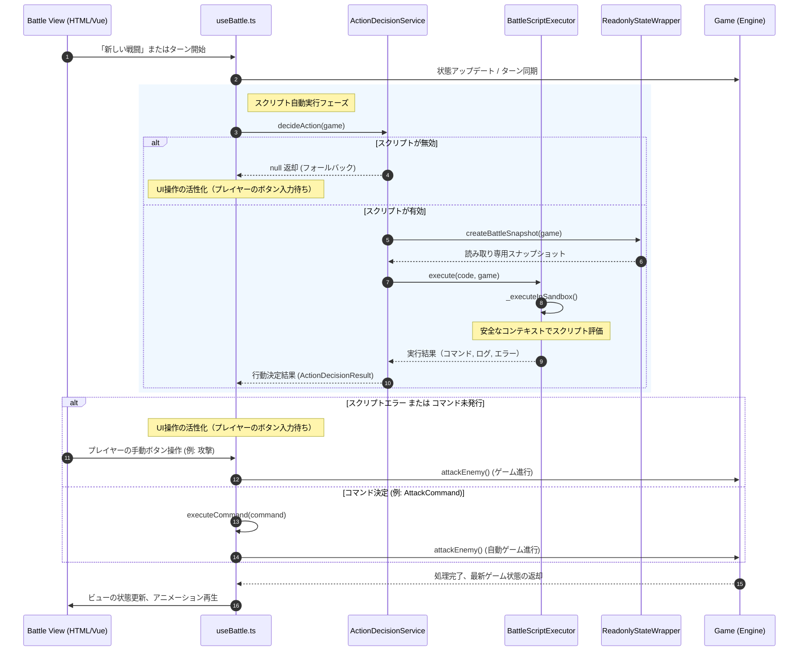

# プログラマブルアクション: 実装構成と動作フロー仕様

このドキュメントでは、プログラマブルアクションを構成するモジュールの責務配置、ゲームループ内での詳細なシーケンスフロー、および Vue 3 の `useBattle` Composable に対する拡張定義について解説します。

---

## モジュール構造と責務分割

プログラマブルアクションの実装は `ts/battle/script/` ディレクトリ配下にカプセル化されており、Vue のビューおよびゲームエンジンコアと連携します。

```
ts/battle/
├── composables/
│   └── useBattle.ts          # [統合点] Vue 状態同期、自動実行ライフサイクル制御
├── game.ts                   # ゲームエンジンコア（状態保持、アクション処理）
└── script/
    ├── index.ts              # モジュールの外部公開エントリーポイント
    ├── BattleScriptTypes.ts  # スクリプトコンテキストやコマンド、実行結果等の型定義
    ├── ReadonlyStateWrapper.ts # ゲームステートからイミュータブルなスナップショットを生成
    ├── BattleScriptExecutor.ts # 安全なサンドボックスでのスクリプト評価・実行エンジン
    └── ActionDecisionService.ts # 行動決定（スクリプト優先 / UIフォールバック）を管理するサービス
```

### 1. `BattleScriptTypes.ts`
スクリプト環境で使用されるすべてのインターフェース定義と実行パラメータを保持します。
* `BattleScriptContext`: スクリプト内に公開される変数・関数の定義。
* `ActionCommand`: スクリプトが決定した行動（`attack`, `heal`, `useItem` 等）を表現する判別共用体。
* `ScriptExecutionLimits`: 最大実行時間（デフォルト `100ms`）などの安全性パラメータ。

### 2. `ReadonlyStateWrapper.ts`
ゲーム内部の可変状態オブジェクト（`Game` インスタンスから取得する `player`, `enemy` など）をディープコピーし、`Object.freeze()` を適用して完全にイミュータブルなスナップショットへと変換するアダプターです。
* `createBattleSnapshot(game)`: スナップショット作成の起点メソッド。

### 3. `BattleScriptExecutor.ts`
不変スナップショットおよびコマンド蓄積用コールバック関数を注入した `BattleScriptContextImpl` を作成し、JavaScript の `Function` コンストラクタを用いて隔離環境（サンドボックス）でスクリプトを実行します。
* 静的解析による危険なキーワードの遮断、`"use strict";` による `this` 脱出防止、およびグローバルスコープの隔離（`undefined` マッピング）を担います。

### 4. `ActionDecisionService.ts`
スクリプトコードの構文チェック（`validateSyntax`）や、行動決定プロセスの調停者として振る舞います。
* `decideAction(game)`: スクリプトによる自動行動決定を試行し、実行結果を返却します。スクリプトが無効、または行動が未決定の場合は `null` を返し、UI待機状態へ遷移させます。

---

## 動作ライフサイクルフロー

バトル進行時における行動決定からコマンド実行までの詳細なシークエンスフローです。



---

## `useBattle` Composable 拡張定義

ビューとのインターフェースとなる `useBattle` には、スクリプト実行をサポートするために以下の状態変数とメソッドが追加されています。これらはビューテンプレートやスクリプトエディタコンポーネントから参照されます。

### リアクティブ状態 (Ref / Computed)

* **`scriptEnabled`** (`Ref<boolean>`): 
  スクリプト実行が有効になっているかどうかの状態。
* **`scriptCode`** (`Ref<string>`): 
  現在エディタに入力されているスクリプトのソースコード。
* **`scriptLogs`** (`Ref<string[]>`): 
  直近のスクリプト実行で蓄積されたデバッグログメッセージの配列。
* **`lastScriptError`** (`Ref<string | null>`): 
  直近のスクリプトパースまたは実行で発生した例外エラーメッセージ。
* **`canStartNewBattle`** (`ComputedRef<boolean>`): 
  非戦闘時（`idle`, `victory`, `defeat`）のみ新規戦闘開始を許可する判定プロパティ。

### メソッド

* **`setScript(code: string): void`**:
  新しいスクリプトコードを設定します。設定時、構文チェック（`validateSyntax`）が実行され、エラーがある場合は `lastScriptError` に記録され、例外がスローされます。
* **`setScriptEnabled(enabled: boolean): void`**:
  スクリプトの有効/無効状態を切り替えます。
* **`tryExecuteScript(): boolean`**:
  戦闘中にスクリプトの実行をトリガーします。コマンドが決定し実行できた場合は `true`、UI手動入力待ちにフォールバックした場合は `false` を返します。
* **`executeCommand(command: ActionCommand): boolean`**:
  決定された `ActionCommand`（`attack`, `heal`, `defend` 等）を解釈し、実際のゲーム進行ロジックメソッドへディスパッチします。
* **`clearScriptLogs(): void`**:
  UI表示用のスクリプトログを空にします。
